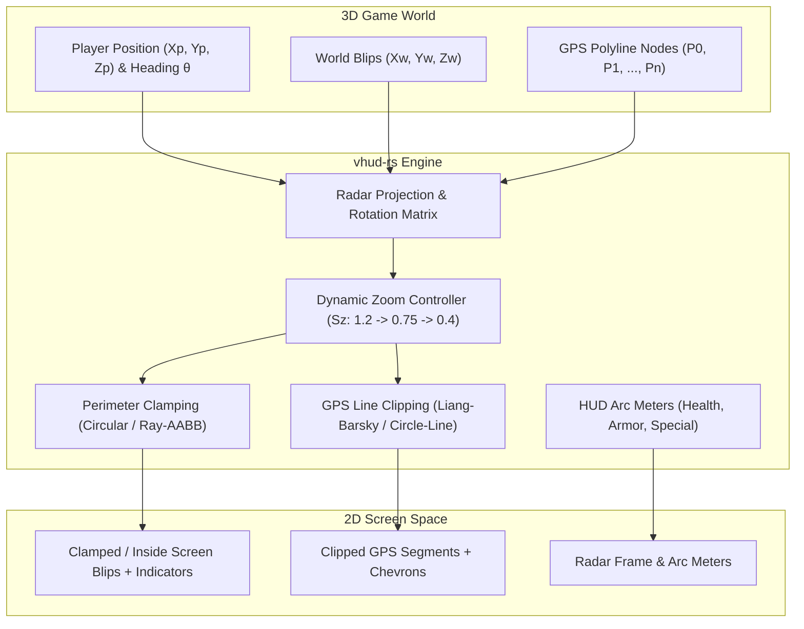

# vhud-rs

[](https://crates.io/crates/vhud-rs)
[](https://docs.rs/vhud-rs)
[](https://code.brandonhubbard.com/vhud-rs/)
[](https://code.brandonhubbard.com/vhud-rs/)
[](LICENSE)
[](https://github.com/bhubbard/vhud-rs)

A high-performance, pure Rust port and modernization of the minimap, radar projection, blip management, GPS polyline clipping, and HUD ring meter systems from **`gennariarmando/v-hud`** (C++).

Designed for game developers, custom HUD overlays, simulators, and GTA-style navigation engines with zero unsafe code and minimal dependencies.

---

### [🎮 Explore the Live Interactive Simulator](https://code.brandonhubbard.com/vhud-rs/)

---

## Architecture Overview



---

## Mathematical Architecture

### 1. 3D World to 2D Radar Coordinate Projection

Given a player position $\mathbf{P} = (X_p, Y_p)$ and any arbitrary world entity position $\mathbf{W} = (X_w, Y_w)$, the translation vector in world coordinates is:

$$\Delta X = X_w - X_p, \quad \Delta Y = Y_w - Y_p$$

To orient the radar so that the player's forward direction is always oriented upwards on the display, we rotate this offset by the player's yaw heading $\theta$:

$$\begin{bmatrix} X_r \\ Y_r \end{bmatrix} = \begin{bmatrix} \cos \theta & \sin \theta \\ -\sin \theta & \cos \theta \end{bmatrix} \begin{bmatrix} \Delta X \\ \Delta Y \end{bmatrix}$$

Expanding the matrix multiplication:

$$X_r = \Delta X \cos \theta + \Delta Y \sin \theta$$
$$Y_r = -\Delta X \sin \theta + \Delta Y \cos \theta$$

- $+Y_r$ points directly forward along the player's line of sight.
- $+X_r$ points directly to the player's right.

#### Screen Mapping
Screen coordinates have their origin at the top-left $(0,0)$ where positive $Y$ extends downwards. With radar screen center $(x_{center}, y_{center})$ and effective zoom scale $S_z$:

$$x_{screen} = x_{center} + X_r \cdot S_z$$
$$y_{screen} = y_{center} - Y_r \cdot S_z$$

#### Exact Inverse Transformation (Screen to World)
Because the rotation matrix $\mathbf{R}(\theta)$ is orthogonal, its inverse is its transpose $\mathbf{R}^T(\theta)$:

$$X_r = \frac{x_{screen} - x_{center}}{S_z}, \quad Y_r = \frac{y_{center} - y_{screen}}{S_z}$$

$$\Delta X = X_r \cos \theta - Y_r \sin \theta$$
$$\Delta Y = X_r \sin \theta + Y_r \cos \theta$$

$$X_w = X_p + \Delta X, \quad Y_w = Y_p + \Delta Y$$

---

### 2. Dynamic Radar Zoom ($S_z$)

Radar zoom scales dynamically with locomotion state and vehicle velocity $v$ (in $\text{km/h}$):

$$S_{target}(v) = \begin{cases} 
S_{foot} \approx 1.20 & \text{On foot} \\
S_{foot} + (S_{normal} - S_{foot}) \cdot \frac{v}{v_{thresh}} & v \le 120\text{ km/h} \\
S_{normal} + (S_{high} - S_{normal}) \cdot \frac{v - v_{thresh}}{v_{max} - v_{thresh}} & v > 120\text{ km/h}
\end{cases}$$

Where default values are:
- $S_{foot} = 1.20$
- $S_{normal} = 0.75$
- $S_{high} = 0.40$
- $v_{thresh} = 120.0\text{ km/h}$
- $v_{max} = 240.0\text{ km/h}$

Smooth temporal smoothing is computed each frame with delta time $\Delta t$:

$$S_z(t + \Delta t) = S_z(t) + \left( S_{target} - S_z(t) \right) \cdot \left(1 - e^{-k \cdot \Delta t}\right)$$

---

### 3. Blip Perimeter Clamping

When targets are beyond the radar perimeter, their positions are clamped to the boundary edge while rendering an outward-pointing direction indicator.

#### Circular Radar Clamping
Given screen offset $\mathbf{v} = (\Delta x_s, \Delta y_s)$ from radar center:
If $\|\mathbf{v}\| > R_{clamp}$:

$$\mathbf{v}_{clamped} = R_{clamp} \cdot \frac{\mathbf{v}}{\|\mathbf{v}\|}, \quad \phi = \operatorname{atan2}(\Delta y_s, \Delta x_s)$$

#### Rectangular Radar Clamping (Ray-AABB Intersection)
For rectangular radar with half-extents $(hw, hh)$:
If $|\Delta x_s| > hw$ or $|\Delta y_s| > hh$:

$$t = \min\left( \frac{hw}{|\Delta x_s|}, \frac{hh}{|\Delta y_s|} \right)$$
$$\mathbf{v}_{clamped} = t \cdot \mathbf{v}$$

#### Relative Elevation Indicator
Elevation difference $\Delta Z = Z_{target} - Z_{player}$:
- $\Delta Z > +3.5\text{ m}$: Render **Upward Arrow** $\blacktriangle$ (Target is above player)
- $\Delta Z < -3.5\text{ m}$: Render **Downward Arrow** $\blacktriangledown$ (Target is below player)
- $|\Delta Z| \le 3.5\text{ m}$: Level icon (Standard flat icon)

---

### 4. GPS Route Polyline Clipping

`vhud-rs` implements two high-speed line segment clipping algorithms to restrict route paths strictly to the visible radar viewport:

1. **Liang-Barsky Parametric Clipping**: Used for rectangular radar viewports. Computes parametric entry/exit values $t_0, t_1 \in [0, 1]$ against boundary inequalities:
   $$p_k \cdot t \le q_k$$
2. **Circular Disk Line Clipping**: Intersects parametric line segment $\mathbf{S}(t) = \mathbf{P}_0 + t(\mathbf{P}_1 - \mathbf{P}_0)$ with the radar perimeter circle $\|\mathbf{S}(t) - \mathbf{C}\|^2 = R^2$ via the quadratic formula.

---

### 5. HUD Ring Meters

Encircling meters render player stats around the perimeter:
- **Health Arc**: Green quadrant arc $[ \pi, \frac{\pi}{2} ]$ with low-health warning pulsation ($< 25\%$).
- **Armor Arc**: Blue quadrant arc $[ \frac{\pi}{2}, 0 ]$.
- **Special Ability Arc**: Concentric outer yellow/orange arc.

Active arc coverage from start angle $\theta_{start}$ to end angle $\theta_{end}$ with percentage $p \in [0, 1]$:

$$\theta_{fill} = \theta_{start} + (\theta_{end} - \theta_{start}) \cdot p$$

Pulsing alpha modulation during critical health:

$$\alpha(t) = 0.65 + 0.35 \sin(2\pi \cdot f_{pulse} \cdot t)$$

---

## Quickstart

Add `vhud-rs` to your `Cargo.toml`:

```toml
[dependencies]
vhud-rs = "0.1.0"
glam = "0.29"
```

### Complete Example

```rust
use glam::{Vec2, Vec3};
use vhud_rs::{
    RadarConfig, RadarProjection, Blip, BlipType, BlipManager,
    GpsRoute, RouteNavigator, HudRingSystem, VehicleState,
};

fn main() {
    // 1. Initialize Circular Radar (radius 100px at center (150, 850))
    let config = RadarConfig::new_circular(Vec2::new(150.0, 850.0), 100.0);
    let mut radar = RadarProjection::new(config);

    // 2. Set dynamic zoom based on driving speed (95 km/h)
    radar.zoom.update(VehicleState::InVehicle { speed_kmh: 95.0 }, 0.016);

    // 3. Register Blips
    let mut blip_manager = BlipManager::new();
    blip_manager.add_or_update(
        Blip::new(1, Vec3::new(450.0, 320.0, 10.0), BlipType::Waypoint)
            .with_clamp(true),
    );
    blip_manager.add_or_update(
        Blip::new(2, Vec3::new(120.0, 95.0, 35.0), BlipType::Enemy),
    );

    // 4. Setup GPS Route Navigation
    let mut navigator = RouteNavigator::new();
    let waypoints = vec![
        Vec3::new(100.0, 100.0, 0.0),
        Vec3::new(250.0, 180.0, 0.0),
        Vec3::new(450.0, 320.0, 10.0),
    ];
    navigator.set_route(GpsRoute::new(waypoints));

    // 5. Setup HUD Rings (Health, Armor, Special)
    let mut hud_rings = HudRingSystem::new_gta_v_circular(100.0, 6.0);
    hud_rings.set_health(20.0); // Triggers low-health pulse alarm
    hud_rings.set_armor(80.0);

    // 6. Process Frame
    let player_pos = Vec3::new(100.0, 100.0, 5.0);
    let player_heading = 0.0; // Facing North

    let rendered_blips = blip_manager.process_blips(player_pos, player_heading, &radar);
    let rendered_gps = navigator.render_route(player_pos, player_heading, &radar);
    let rendered_rings = hud_rings.process_meters(&radar.config);

    println!("Visible Blips: {}", rendered_blips.len());
    if let Some(gps) = rendered_gps {
        println!("GPS Segments: {}, Remaining: {:.1}m", gps.segments.len(), gps.remaining_distance);
    }
}
```

---

## Test Suite

Run unit and integration tests covering rotation math, clamping, zoom lerp, and clipping algorithms:

```bash
cargo test
```

```
running 19 tests
test test_bounds_inside_detection ... ok
test test_dynamic_zoom_states_and_lerp ... ok
test test_coordinate_rotation_cardinal_directions ... ok
test test_screen_coords_orientation ... ok
test test_world_to_radar_round_trip ... ok
test test_screen_projection_and_inverse ... ok
test test_rectangular_edge_clamping ... ok
test test_altitude_thresholds ... ok
test test_circular_edge_clamping ... ok
test test_blip_manager_priority_and_filtering ... ok
test test_cohen_sutherland_clipping ... ok
test test_circular_clip ... ok
test test_route_navigator_render_and_arrows ... ok
test test_liang_barsky_clipping ... ok
test test_gps_route_navigation_and_arrival ... ok
test test_low_health_pulsing ... ok
test test_hud_ring_system_defaults_and_process ... ok
test test_arc_meter_coverage_and_percentage ... ok
test src/lib.rs - Quickstart Example (line 11) ... ok

test result: ok. 19 passed; 0 failed; 0 ignored; finished in 0.50s
```

---

## License

Licensed under either of:
- Apache License, Version 2.0 ([LICENSE-APACHE](LICENSE-APACHE) or http://www.apache.org/licenses/LICENSE-2.0)
- MIT license ([LICENSE-MIT](LICENSE-MIT) or http://opensource.org/licenses/MIT)

at your option.
